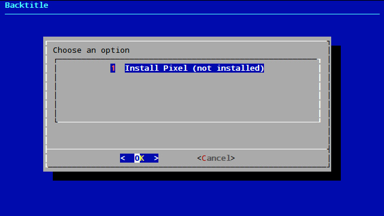
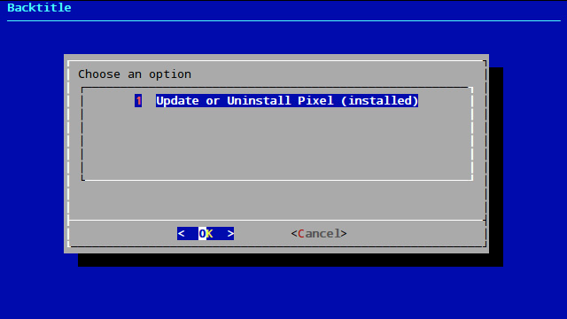
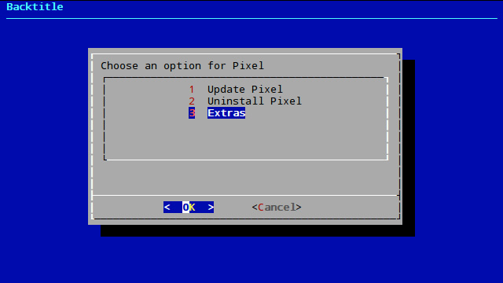
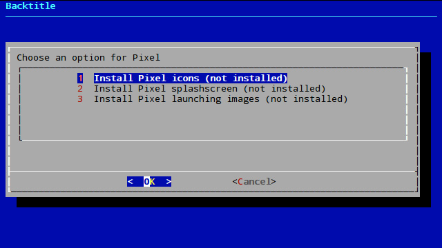
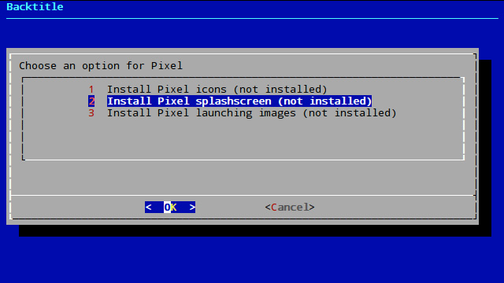
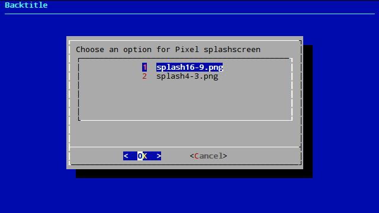
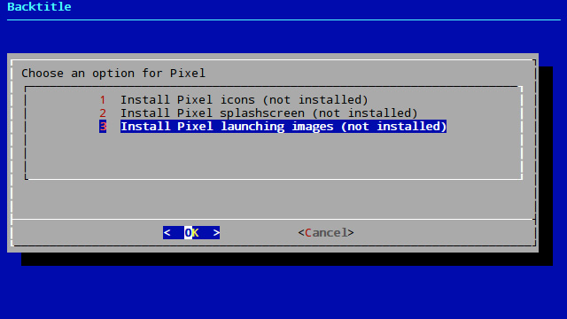

# Extras for RetroPie themes

> This is my first shell script ever, so there are surely code errors. [Contributing](#contributing) is most welcomed.

This script let's you install some extras for RetroPie themes. These extras are:

* [x] Icons
* [x] Splashscreens
* [x] Launching images









## Installation

```
cd /home/pi/
git clone https://github.com/hiulit/es-theme-extras.git
cd es-theme-extras/
sudo chmod +x es-theme-extras.sh
sudo ./es-theme-extras.sh
```

## The big issue

At this moment, [Pixel](https://github.com/ehettervik/es-theme-pixel) is the only theme that works with this script because it's the only one (that I know of) that has [icons](https://github.com/ehettervik/es-theme-pixel/tree/master/retropie/icons), splashscreens ([16:9](https://github.com/ehettervik/es-theme-pixel/blob/master/splash16-9.png) and [4:3](https://github.com/ehettervik/es-theme-pixel/blob/master/splash4-3.png)) and [launching images](https://github.com/ehettervik/es-runcommand-splash).

Pixel theme has both icons and splashscreens in the same repository and launching images has its own repository.

This script is created under these premises:

* Icons and splashscreens must be in the same repository `https://github.com/USERNAME/es-theme-THEME`.
* Icons must be in path `/retropie/icons`.
* Splashscreens must be in the root path and named `splash16-9.png` and/or `splash4-3.png`.
* Launching images must be in another repository `https://github.com/USERNAME/es-runcommand-splash`.

I think that could be **standarized** so that every theme could take advantage of this script.

## Proposal for standarization

I propose two versions:

* [Self-contained](#self-contained-same-repository-version) (all extras in the same repository).
* [Diferent repositories](#diferent-repositories-version) for each extra (icons, splashscreens and launching images).

When the decision is made, I'll make the necessary changes according to the version agreed upon.

### Self-contained (same repository) version

* **Theme URL**: `https://github.com/USERNAME/es-theme-THEME`
* **Icons URL**: `https://github.com/USERNAME/es-theme-THEME/retropie/icons`
* **Splashscreens URL**: `https://github.com/USERNAME/es-theme-THEME/retropie/splashscreens`
* **Launching images URL**: `https://github.com/USERNAME/es-theme-THEME/retropie/launching-images`

### Diferent repositories version

* **Theme URL**: `https://github.com/USERNAME/es-theme-THEME`
* **Icons URL**: `https://github.com/USERNAME/es-theme-THEME-icons`
* **Splashscreens URL**: `https://github.com/USERNAME/es-theme-THEME-splashscreens`
* **Launching images URL**: `https://github.com/USERNAME/es-theme-THEME-launching-images`

Where **USERNAME** is GitHub's username and **THEME** is the theme's name.

## Filetype, naming convention and formatting

In both cases the filetype, naming convention and formatting must be the same, as follows:

* [Icons](#icons)
* [Splashscreens](#splashscreens)
* [Launching images](#launching-images)

### Icons

#### Filetype

* Icons must be `.png` filetype

#### Naming conventions

Names must be the same as RetroPie's default icons:

* audiosettings.png
* bluetooth.png
* configedit.png
* esthemes.png
* filemanager.png
* raspiconfig.png
* retroarch.png
* retronetplay.png
* rpsetup.png
* runcommand.png
* showip.png
* splashscreen.png
* wifi.png

See https://github.com/RetroPie/RetroPie-Setup/tree/master/scriptmodules/supplementary/retropiemenu/icons

#### Formatting

Same as RetroPie's default icons:

* Names must be all lowercase
* No spaces

See https://github.com/RetroPie/RetroPie-Setup/tree/master/scriptmodules/supplementary/retropiemenu/icons

### Splashscreens

#### Filetype

* Image splashscreens must be `.png` filetype
* Video splashscreens must be `.mp4` filetype

#### Naming conventions

#### Images

* `THEME`-`splashscreen`-`16-9.png`

e.g `pixel-splashscreen-16-9.png`

* `THEME`-`splashscreen`-`4-3.png`

e.g `pixel-splashscreen-4-3.png`

#### Videos

* `THEME`-`splashscreen`-`video.mp4`

e.g `pixel-splashscreen-video.mp4`

#### Formatting

* Names must be all lowercase
* Spaces must be hyphens

### Launching images

#### Filetype

Launching images must be `.png` or `.jpg` filetype

#### Naming conventions

* `SYSTEM_NAME/launching.png`

e.g. `nes/launching.png`

See https://github.com/ehettervik/es-runcommand-splash

#### Formatting

* Names must be all lowercase
* No spaces

## Changelog

### v0.1.1 (November 7th 2017)

* Fixed backtitle.
* Removed comments.
* Fixed `git pull` when theme needs an update.

### v0.1.0 (October 5th 2017)

* Initial commit

## Contributing

First of all, I really appreciate that you're willing to ~~waste~~ spend some time contributing to **es-theme-extras**! 🎉👍

You can help make **es-theme-extras** better by [reporting issues](#issues) or [contributing code](#pull-requests).

### Issues

[Issues](https://github.com/hiulit/es-theme-extras/issues) can be used not only for bug reporting, but also for suggesting improvements, whether they are code related (cleaner code, modularity, etc.) or feature requests.

#### Guidelines

* Search [previous issues](https://github.com/hiulit/es-theme-extras/issues?utf8=%E2%9C%93&q=is%3Aissue) before creating a new one, as yours may be a duplicate.
* Use a clear and descriptive title for the issue to identify the problem.
* Describe the exact steps which reproduce the problem in as many details as possible.

### Pull requests

[Pull requests](https://help.github.com/articles/creating-a-pull-request/) are most welcomed! 😃

* Fork **es-theme-extras**: `git clone git@github.com:your-username/es-theme-extras.git`.
* Create a **new branch** and make the desired changes there.
* [Create a pull request](https://github.com/hiulit/es-theme-extras/pulls).

## Authors

Me 😛 [@hiulit](https://github.com/hiulit).

## Credits

Filetype, naming conventions and formatting taken (partially and revisited) from [retropie-splashscreens-extra repository by HerbFargus](https://github.com/HerbFargus/retropie-splashscreens-extra/blob/master/README.md)

## License

MIT License

Copyright (c) 2017 Xavier Gómez Gosálbez

Permission is hereby granted, free of charge, to any person obtaining a copy
of this software and associated documentation files (the "Software"), to deal
in the Software without restriction, including without limitation the rights
to use, copy, modify, merge, publish, distribute, sublicense, and/or sell
copies of the Software, and to permit persons to whom the Software is
furnished to do so, subject to the following conditions:

The above copyright notice and this permission notice shall be included in all
copies or substantial portions of the Software.

THE SOFTWARE IS PROVIDED "AS IS", WITHOUT WARRANTY OF ANY KIND, EXPRESS OR
IMPLIED, INCLUDING BUT NOT LIMITED TO THE WARRANTIES OF MERCHANTABILITY,
FITNESS FOR A PARTICULAR PURPOSE AND NONINFRINGEMENT. IN NO EVENT SHALL THE
AUTHORS OR COPYRIGHT HOLDERS BE LIABLE FOR ANY CLAIM, DAMAGES OR OTHER
LIABILITY, WHETHER IN AN ACTION OF CONTRACT, TORT OR OTHERWISE, ARISING FROM,
OUT OF OR IN CONNECTION WITH THE SOFTWARE OR THE USE OR OTHER DEALINGS IN THE
SOFTWARE.
